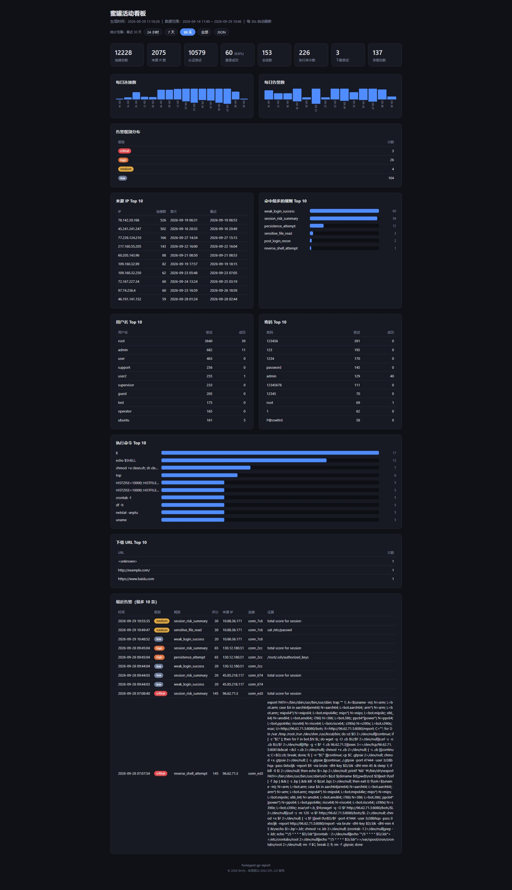

# honeypot-go


[中文文档](README.md) | [English](README.en.md)

一个基于 Go 的高交互 SSH 蜜罐框架。以极低的真实风险诱捕、记录、分析攻击者的完整攻击链：**扫描 → 爆破 → 登录 → 侦察 → 载荷投递 → 横向移动**。

所有命令、文件、网络行为均在**用户态仿真**执行，蜜罐自身永不受"中毒"；默认禁止一切真实出站，杜绝被用作跳板。

> 警告：本工具仅限部署于你**拥有授权**的资产与网络环境中使用，用于安全研究与攻防演练。未经授权部署蜜罐可能触犯法律，后果自负。

---

## 功能特性

**已实现（M1）**

- 多端口监听（默认 `2222` / `22222`），可伪装 OpenSSH 8.9 版本指纹
- 认证欺骗：弱口令库 + 概率放行 + 随机校验延迟（防用户名枚举侧信道）
- 交互式 Shell 仿真：`cd / ls / cat / uname / id / ps / whoami / echo / pwd` 等内建与系统命令，支持 `&& / | / ;` 组合
- 内存虚拟文件系统：预置逼真 Linux 根目录快照（`/etc/passwd`、`/proc`、`/home/*` 动态内容）
- 全链路事件记录：连接 / 认证 / 会话 / 命令，结构化入库（SQLite）+ 原始流水（JSONL）
- ttyrec 会话录制：攻击者的每次按键与终端输出可逐帧回放
- 优雅退出：停机前 drain 事件，保证数据零丢失

**已实现（M2）**

- 认证方法扩展：`keyboard-interactive`（问答式模拟）、`publickey`（记录后必拒）、`NoClientAuth` 探测性登录
- 完整 Shell 语法解析（`mvdan.cc/sh` AST）：`$()` 命令替换、`&& / || / ;` 组合、管道、通配符展开、重定向、后台任务
- 虚拟网络仿真（`internal/vnet`）：`ping / curl / wget / nc` 不真实发包，记录目标 IP / 端口 / URL
- SFTP 子系统仿真：列目录 / 下载 / 上传全部走虚拟 FS，上传内容捕获为 `file.written` 事件
- 规则引擎 + 风险评分（`internal/detect`）：爆破、侦察、下载投递、反弹 Shell、持久化、横向移动 6 类规则，连接级累计评分 + 严重级别告警
- 告警推送：`alert` 事件入库 + 可选 Webhook（飞书/钉钉/Slack 机器人）

**规划中（M3）**

- YARA 载荷检测、SIEM/CEF 对接、攻击链可视化

---

## 快速开始

```bash
# 编译（Windows）
go build -o honeypot.exe ./cmd/honeypot

# 运行（默认读取 configs/honeypot.yaml）
honeypot.exe

# 或直接 go run
go run ./cmd/honeypot -config configs/honeypot.yaml
```

从另一个终端测试：

```bash
# 用弱口令库里的密码尝试登录（默认 success_probability=0.02，不一定放行）
ssh -p 2222 root@127.0.0.1
# 密码: 123456
```

登录后即进入仿真 Shell，执行任意命令观察输出，随后：

```bash
go run ./cmd/dbquery        # 查看捕获的全部攻击事件
```

### 运行效果示例（冒烟测试实测输出）

```
$ ssh -p 2222 root@127.0.0.1
root@ubuntu-web-01:~# whoami
root
root@ubuntu-web-01:~# uname -a
Linux ubuntu-web-01 5.15.0-91-generic #101-Ubuntu SMP ... x86_64 GNU/Linux
root@ubuntu-web-01:~# cat /etc/passwd
root:x:0:0:root:/root:/bin/bash
ubuntu:x:1000:1000:ubuntu:/home/ubuntu:/bin/bash
www-data:x:33:33:www-data:/var/www:/usr/sbin/nologin
root@ubuntu-web-01:~# cat /etc/shadow
root:$6$rounds=656000$ZyHdQ8m4tZ8mK0n$...:19800:0:99999:7:::
root@ubuntu-web-01:~# exit
```

捕获结果：

```
== auth_attempts ==
  conn_xxx | 2026-08-20T... | user=root pass=123456 method=password success=1 delay=512ms
== commands ==
  sess_xxx | 2026-08-20T... | cwd=/root | code=0 dur=12ms | whoami
  sess_xxx | 2026-08-20T... | cwd=/root | code=0 dur=15ms | uname -a
```

---

## 配置说明

编辑 `configs/honeypot.yaml`：

```yaml
server:
  listen: ["0.0.0.0:2222", "0.0.0.0:22222"]   # 监听地址
  max_connections: 500
  idle_timeout: 5m

ssh:
  server_version: "SSH-2.0-OpenSSH_8.9p1 Ubuntu-3ubuntu0.6"   # 伪装版本

auth:
  success_probability: 0.02   # 弱口令命中后的放行概率（0~1），生产 0.01~0.05，测试 1.0
  delay_ms: [200, 800]        # 认证模拟延迟（毫秒），模拟真实密码校验
  keyboard_interactive: true  # keyboard-interactive 认证开关（默认开）
  publickey: true             # 公钥认证开关（默认开，记录后必拒）
  allow_no_auth: false        # 允许探测性登录（制造高价值会话，默认关）
  restrict_users: true        # 只允许 vfs.users 里的用户名登录成功（默认开；false=任意用户名弱口令命中即放行）
  weak_passwords: [root, admin, password, 123456, ...]   # 弱口令库

vfs:
  hostname: "ubuntu-web-01"   # 虚拟主机名（prompt、/etc/hostname）
  users: ["root", "ubuntu", "www-data"]

storage:
  data_dir: "data"            # 数据目录（建议部署时改绝对路径）
  driver: "sqlite,jsonl"      # sqlite 结构化 + jsonl 原始流水，可同时启用

detect:
  enabled: true               # 规则引擎 + 风险评分 + 告警
  webhook_url: ""             # 可选：告警 JSON POST 推送到 webhook（如飞书/钉钉）

log:
  level: "info"               # debug / info / warn / error
```

---

## 数据与事件查看

数据落盘位置：

```
data/
├── honeypot.db          # SQLite 结构化主存储（5 张表）
├── events/YYYY-MM-DD.jsonl     # JSONL 原始事件流水（按天分片）
├── recordings/<sess_id>.ttyrec # ttyrec 会话录制
└── host_key             # SSH 主机密钥（机密，勿提交）
```

| 工具 | 用途                               | 用法 |
|---|----------------------------------|---|
| `cmd/dbquery` | 打印全部 5 张表（连接/爆破/会话/命令/扩展事件）      | `go run ./cmd/dbquery` |
| `cmd/ttyshow` | 回放 ttyrec 录制为带时间戳文本              | `go run ./cmd/ttyshow data/recordings/*.ttyrec` |
| `cmd/anti_attack` | SSH攻击反制：监听端口并把流量反弹回客户端源 IP 的同一端口 | `go run ./cmd/anti_attack -port 22 -log logs/anti_attack.log` |
| `cmd/report` | Web 活动看板：只读数据库起 HTTP 服务，浏览器查看统计图表 | `go run ./cmd/report -listen 127.0.0.1:8080` |
| SQLite 关联查询 | 按 IP 关联攻击者全部行为                   | `sqlite3 data/honeypot.db "SELECT c.source_ip, a.username, a.password FROM auth_attempts a JOIN connections c ON a.connection_id = c.id;"` |

> `auth_attempts` 记录每次爆破的**密码原文**；`commands` 记录每条命令的 exit code / 耗时 / 输出摘要；`events` 通用表承载扩展事件（下载/连接/文件写入/告警），payload 为 JSON。

---

## 构建与编译

`scripts/` 下提供 PowerShell 构建脚本，自动设置 `GOOS/GOARCH/CGO_ENABLED=0`（纯静态编译），并对产物做魔数校验，防止编出与目标平台不符的二进制。

### 本机编译（Windows）

```powershell
powershell -ExecutionPolicy Bypass -File scripts\build-win.ps1              # amd64（默认）
powershell -ExecutionPolicy Bypass -File scripts\build-win.ps1 -Arch arm64  # ARM64
```

产物落在 `target/`：

| 产物 | 说明        |
|---|-----------|
| `target/honeypot-windows-amd64.exe` | 蜜罐主程序     |
| `target/ttyshow-windows-amd64.exe` | ttyrec 回放 |
| `target/dbquery-windows-amd64.exe` | 事件查询      |
| `target/anti_attack-windows-amd64.exe` | ssh攻击反制   |
| `target/report-windows-amd64.exe` | Web 活动看板   |

脚本校验产物前 2 字节为 `MZ`（PE 魔数）。

### 交叉编译（Windows → Linux ELF）

```powershell
powershell -ExecutionPolicy Bypass -File scripts\build-linux.ps1            # amd64
powershell -ExecutionPolicy Bypass -File scripts\build-linux.ps1 -Arch arm64 # ARM64
```

产物落在 `target/`：`honeypot-linux-amd64`、`ttyshow-linux-amd64`、`dbquery-linux-amd64`、`anti_attack-linux-amd64`、`report-linux-amd64`（arm64 同理）。脚本校验产物前 4 字节为 `7F 45 4C 46`（ELF 魔数），可防止误编出 Windows PE。

> 在 Linux 主机上本机编译不必用脚本，直接 `CGO_ENABLED=0 GOOS=linux GOARCH=amd64 go build -o honeypot ./cmd/honeypot` 即可。脚本主要给 Windows 开发者交叉编译到 Linux 部署机使用。

---

## anti_attack：SSH攻击反制

`cmd/anti_attack` 是与蜜罐配套的独立工具：监听本机一个端口，accept 后取客户端源 IP，反弹连回该源 IP 的同一端口，然后双向透传字节流。蜜罐场景下常作为诱导层放在蜜罐前面：攻击者扫到本机端口，流量被反弹回他自己的同一端口——既不暴露本地真实服务，也能记录来连的 IP / 字节数 / 时间。

**用法**

```powershell
anti_attack.exe -port 22 -log logs/anti_attack.log -log-level info
```

**flag**

| flag | 默认 | 含义 |
|---|---|---|
| `-port` | `22` | 本机监听端口；客户端来连后反弹连回其源 IP 的同一端口 |
| `-log` | `logs/anti_attack.log` | 活跃日志文件名；超阈值后由 lumberjack 归档为 `<name>-YYYYMMDDTHHMMSS.NNN.log.gz`（NNN 为同秒内的滚动序号） |
| `-log-level` | `info` | `debug` / `info` / `warn` / `error` |
| `-log-size` | `100` | 单日志文件最大 MB，超出滚动 |
| `-log-backups` | `7` | 保留几个旧日志文件 |
| `-log-age` | `30` | 旧日志最多保留天数 |
| `-log-compress` | `true` | 是否 gzip 压缩已滚动出去的日志 |
| `-d` / `--daemon` | `false` | 后台运行：fork 出子进程脱离终端，仅 Linux |
| `-pidfile` | `logs/anti_attack.pid` | PID 文件路径；daemon 模式启动后自动写入当前 PID |

**日志落地**

活跃日志写入 `-log` 指定的文件；超 `-log-size` 后由 lumberjack 归档为 `anti_attack-YYYYMMDDTHHMMSS.NNN.log.gz`（`.000` / `.001` 为同秒内的滚动序号），超过 `-log-age` 天的旧归档自动清理。

**与蜜罐配合 & 非 root 绑定 22**

`anti_attack` 默认监听 `-port 22`（特权端口）。非 root 进程绑不上 1024 以下的端口，三种授权方案详见下节「部署到 Linux / 非 root 绑定低位端口」。

如果不想给授权，把 `-port` 改高位（如 `2222`），蜜罐也改监听同一高位端口即可——攻击者扫到 `2222` 时先打到 `anti_attack`，由 `anti_attack` 反弹回去，蜜罐仍可独立监听做高交互仿真。

**后台启动（Linux）**

```bash
./anti_attack-linux-amd64 -port 22 -log logs/anti_attack.log -d
```

父进程打印子 PID 后退出，子进程在新会话里独立运行（日志走文件，stdin/stdout/stderr 接到 `/dev/null`）。PID 默认写到 `logs/anti_attack.pid`，可用 `-pidfile <path>` 自定义。Windows 想后台请用 `nssm` 或 `sc.exe CreateService`。

---

## report：Web 活动看板

`cmd/report` 是一个**可独立部署**的 HTTP 服务：以**只读**方式打开蜜罐写出的 SQLite 库文件，把聚合统计渲染成网页看板（概览卡片、每日连接/告警趋势、Top 来源 IP / 用户名 / 密码 / 命令 / 下载 URL、告警级别分布、最近告警明细）。它不写库、不需要停掉正在运行的蜜罐，可与主程序同机或异机部署（只要能读到那个 `.db` 文件）。聚合与渲染逻辑在 `internal/report` 包。



**用法**

```bash
# 起看板服务，浏览器打开 http://127.0.0.1:8080/
./report-linux-amd64 -db data/honeypot.db -listen 127.0.0.1:8080

# 不起服务，导出一次静态 HTML（离线归档/邮件附件）
./report-linux-amd64 -db data/honeypot.db -once -out weekly.html -since 168h
```

**flag**

| flag | 默认 | 含义 |
|---|---|---|
| `-db` | `data/honeypot.db` | SQLite 数据库路径（只读打开，可与运行中的蜜罐共用同一文件） |
| `-listen` | `127.0.0.1:8080` | HTTP 监听地址；对外暴露请自行加防火墙/反向代理鉴权 |
| `-refresh` | `30s` | 看板自动刷新间隔（同时作为报表缓存 TTL），`0` 表示关闭自动刷新 |
| `-top` | `10` | 各类 Top 列表默认条数；请求可用 `?top=` 覆盖（上限 100） |
| `-once` | `false` | 不起 HTTP 服务，生成一次静态 HTML 后退出 |
| `-out` | `report_<时间戳>.html` | 配合 `-once`：输出的 HTML 文件路径 |
| `-since` | 不限制 | 配合 `-once`：只统计最近这段时间，如 `24h`、`168h` |
| `-from` / `-to` | 不限制 | 配合 `-once`：统计范围起点（含）/ 终点（不含），格式 `2006-01-02` 或完整时间戳 |

**HTTP 接口与查询参数**

| 路由 | 说明 |
|---|---|
| `GET /` | HTML 看板页面 |
| `GET /report` | 同一份报表数据的 JSON 输出（便于二次对接） |
| `GET /healthz` | 存活探针，返回 `ok` |

查询参数（`/` 与 `/report` 通用）：`?since=168h` 或 `?from=2026-09-01&to=2026-09-08`（两者互斥）统计时间范围，`?top=20` 调整 Top 列表条数。页面顶部提供 24 小时 / 7 天 / 30 天 / 全部 的快捷切换。参数非法返回 `400`。

> 看板只读打开数据库（DSN 带 `mode=ro`），并在启动时校验 `connections` 表存在——路径写错、库文件不存在会直接报错退出，不会静默创建空库。报表结果按时间范围缓存，TTL 等于 `-refresh`，避免频繁刷新反复扫盘。

**部署（systemd）**

看板通常与蜜罐同机部署、指向同一个 `data/honeypot.db`：

```ini
# /etc/systemd/system/honeypot-report.service
[Unit]
Description=Honeypot Web Report Dashboard
After=network.target

[Service]
Type=simple
User=honeypot
WorkingDirectory=/opt/honeypot
ExecStart=/opt/honeypot/report-linux-amd64 -db /opt/honeypot/data/honeypot.db -listen 127.0.0.1:8080
Restart=always
NoNewPrivileges=true
ProtectSystem=strict
ReadOnlyPaths=/opt/honeypot/data

[Install]
WantedBy=multi-user.target
```

默认只监听 `127.0.0.1`。若要从别的机器访问，建议用 Nginx/Caddy 反向代理并加一层认证（如 basic auth / mTLS），而不是直接把 `-listen` 改成 `0.0.0.0` 裸奔到公网——看板会展示攻击者提交的密码原文等敏感数据。

---

## 部署到 Linux

### 传输与 systemd 守护

```bash
scp target/honeypot-linux-amd64 root@<server>:/opt/honeypot/honeypot
scp configs/honeypot.yaml root@<server>:/opt/honeypot/configs/honeypot.yaml
```

```ini
# /etc/systemd/system/honeypot.service
[Unit]
Description=SSH Honeypot
After=network.target

[Service]
Type=simple
User=honeypot
WorkingDirectory=/opt/honeypot
ExecStart=/opt/honeypot/honeypot -config /opt/honeypot/configs/honeypot.yaml
Restart=always
PrivateTmp=true
NoNewPrivileges=true
ProtectSystem=strict
ReadWritePaths=/opt/honeypot/data /opt/honeypot/logs

[Install]
WantedBy=multi-user.target
```

### 非 root 绑定低位端口（如 22）

非 root 进程默认不能绑定 1024 以下的特权端口。把蜜罐绑到 22 之前，**务必先给真实 SSH 挪端口**，否则会顶掉自己的登录通道把自己锁在外面：

```bash
sed -i 's/^#\?Port .*/Port 2222/' /etc/ssh/sshd_config
systemctl restart sshd
# 确认 2222 能连上后再动 22
```

**方案 A：systemd 发能力（推荐）**

最干净，不改二进制、不依赖 NAT，`User=honeypot` 仍保持非 root。给 service 文件加两行：

```ini
[Service]
User=honeypot
AmbientCapabilities=CAP_NET_BIND_SERVICE
CapabilityBoundingSet=CAP_NET_BIND_SERVICE
```

配置监听 22 后 `systemctl daemon-reload && systemctl restart honeypot` 即可。能力随 unit 持久，二进制升级无需重做。

**方案 B：setcap 文件能力**

不改 service，直接给二进制打能力（项目为静态编译，`setcap` 有效）：

```bash
setcap 'cap_net_bind_service=+ep' /opt/honeypot/honeypot
systemctl restart honeypot
```

注意：重新覆盖二进制后必须再执行一次 `setcap`（能力不跟随文件内容）。若 service 启用 `NoNewPrivileges=true`，部分内核下 file capability 不继承，优先用方案 A。

**方案 C：iptables 端口转发**

蜜罐继续监听高位端口（如 `2222`），把入向 22 转发过去，零能力授予、最安全：

```bash
iptables -t nat -A PREROUTING -p tcp --dport 22 -j REDIRECT --to-port 2222
iptables-save > /etc/iptables/rules.v4   # Debian，持久化
```

部署要点：蜜罐端口对公网开放、**出站默认禁止**（`iptables -A OUTPUT -m owner --uid-owner honeypot -j DROP`）、与业务网段隔离、非 root 运行。

---

## 冒烟测试

```powershell
# 端到端验证：启动蜜罐 → 弱口令登录 → keyboard-interactive → shell 语法 → VNet → SFTP → 数据落盘
powershell -ExecutionPolicy Bypass -File scripts\smoke.ps1
```

测试配置 `data/test.yaml` 将 `success_probability` 调为 `1.0` 保证必放行。

---

## 项目结构

```
honeypot-go/
├── cmd/
│   ├── honeypot/        # 入口：装配、信号优雅退出
│   ├── smoketest/       # 冒烟测试客户端
│   ├── dbquery/         # SQLite 运营查询
│   ├── report/          # Web 活动看板：只读数据库起 HTTP 服务
│   ├── ttyshow/         # ttyrec 录制回放
│   └── anti_attack/     # SSH 攻击反制：监听端口反弹回客户端源 IP 的同一端口
├── internal/
│   ├── config/          # YAML 配置加载与校验
│   ├── event/           # 事件总线（发布/订阅解耦）
│   ├── ident/           # 连接/会话 ID
│   ├── ssh/             # x/crypto/ssh 封装 + SFTP 子系统仿真（sftp.go）
│   ├── auth/            # 认证欺骗（password/keyboard-interactive/publickey）
│   ├── session/         # 会话生命周期
│   ├── shell/           # AST 语法解析（parse.go）+ 命令仿真执行（executor.go）
│   ├── vfs/             # 内存虚拟文件系统
│   ├── vnet/            # 虚拟网络仿真（wget/curl/ping/nc）
│   ├── detect/          # 规则引擎 + 风险评分 + Webhook 告警
│   ├── tty/             # ttyrec 录制
│   ├── report/          # 活动报表聚合（SQL）与 HTML/JSON 渲染，供 cmd/report 看板使用
│   └── store/           # SQLite + JSONL 持久化
├── configs/honeypot.yaml
├── scripts/             # 构建脚本（build-win.ps1 / build-linux.ps1）/ 冒烟测试
└── docs/architecture.md # 完整架构设计
```

完整架构设计（威胁模型、模块细节、数据模型、安全加固、演进路线）见 [docs/architecture.md](docs/architecture.md)。

---

## 安全加固清单

1. **仿真隔离**：不真实执行任何系统命令
2. **出站全禁**：VNet 不真实发包 + 防火墙黑名单兜底
3. **最小权限**：非 root 运行、`ProtectSystem`、`NoNewPrivileges`
4. **资源限制**：每会话超时、连接并发上限（防反制打爆内存）
5. **反探测**：版本指纹伪装与真实 OpenSSH 一致
6. **网络隔离**：蜜罐网段与生产网段物理/逻辑隔离

---

## 许可证

本项目以 **GNU GPL-3.0** 发布（强 copyleft）。任何分发、修改、衍生作品须同样以 GPL-3.0 开源。完整条款见仓库根目录 `LICENSE`。

> 若你修改并分发本程序，须保留版权声明、标注修改日期，并提供对应源码。涉及网络交互的部分另有对应的 AGPL-3.0 要求（如改用 AGPL 请联系维护者）。
